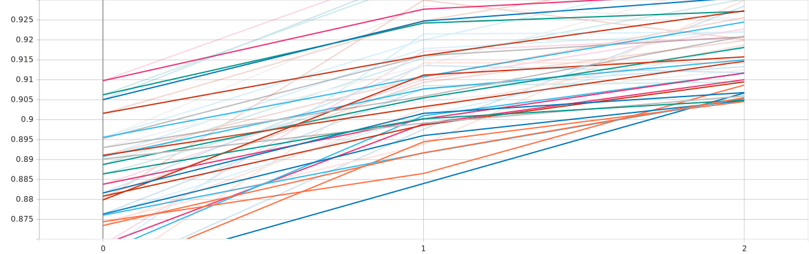

# Rapport de projet — CSC8607 : Introduction au Deep Learning

> **Consignes générales**
> - Tenez-vous au **format** et à l’**ordre** des sections ci-dessous.
> - Intégrez des **captures d’écran TensorBoard** lisibles (loss, métriques, LR finder, comparaisons).
> - Les chemins et noms de fichiers **doivent** correspondre à la structure du dépôt modèle (ex. `runs/`, `artifacts/best.ckpt`, `configs/config.yaml`).
> - Répondez aux questions **numérotées** (D1–D11, M0–M9, etc.) directement dans les sections prévues.

---

## 0) Informations générales

- **Étudiant·e** : ZEGANG Rodrick
- **Projet** : SVHN × CNN convolutionnel personnalisé
- **Dépôt Git** : https://github.com/rodrickAurellZegang/csc8607_projects.git
- **Environnement** : `python == 3.12`, `torch == 2.9.1+cu128`, `cuda == NVIDIA H100 (MIG 1g.12GB)`  
- **Commandes utilisées** :
  - Entraînement : `python -m src.train --config configs/config.yaml`
  - LR finder : `python -m src.lr_finder --config configs/config.yaml`
  - Grid search : `python -m src.grid_search --config configs/config.yaml`
  - Évaluation : `python -m src.evaluate --config configs/config.yaml --checkpoint artifacts/best.ckpt`

---

## 1) Données

### 1.1 Description du dataset

- **Source** : http://ufldl.stanford.edu/housenumbers/
- **Type d’entrée** : Images couleur (RGB)
- **Tâche** : Classification multi-classes
- **Dimensions d’entrée attendues** (`meta["input_shape"]`) : `(3, 32, 32)`
- **Nombre de classes** (`meta["num_classes"]`) : `10`

**D1.**  
Le dataset utilisé est **SVHN (Street View House Numbers)**, fourni par l’université de Stanford.  
Il contient des images couleur de taille **32×32 pixels**, représentant des chiffres (de 0 à 9) extraits automatiquement de photos de numéros de rue.  

Chaque image est associée à **un seul label** correspondant au chiffre central, ce qui en fait un problème de **classification multi-classes à 10 classes**. Les données sont stockées sous forme d’images et chargées via `torchvision.datasets.SVHN`.

### 1.2 Splits et statistiques

| Split | #Exemples | Particularités (déséquilibre, longueur moyenne, etc.) |
|------:|----------:|--------------------------------------------------------|
| Train | ~59 300   | Léger déséquilibre entre classes                      |
| Val   | ~6 600    | Sous-ensemble du train (10 %)                         |
| Test  | 26 032    | Distribution similaire au train                       |

**D2.**  
Le dataset contient **10 classes** (chiffres de 0 à 9).  
Le split d’entraînement est divisé en **train** et **validation**, tandis que le split **test** est fourni officiellement par le dataset.

**D3.**  
Le jeu de validation a été créé en prélevant **10 % du jeu d’entraînement**, de manière aléatoire et reproductible grâce à un **seed fixé à 42**.  
Aucune stratification explicite n’a été appliquée, mais la distribution des classes reste proche de celle du train.

**D4.**  
La distribution des classes montre un **déséquilibre modéré**, certaines classes (notamment le chiffre *1*) étant plus représentées que d’autres.  
Ce déséquilibre peut favoriser les classes fréquentes lors de l’entraînement, ce qui justifie l’utilisation de métriques globales comme l’accuracy.


**D5.**  
Toutes les images ont une taille fixe de **32×32 pixels**, avec **3 canaux couleur (RGB)**.  
Il n’y a pas de séquences variables, ni de labels multiples par image.


### 1.3 Prétraitements (preprocessing) — _appliqués à train/val/test_

Les prétraitements suivants sont appliqués de manière identique aux ensembles **train**, **validation** et **test** :

- Vision :
  - resize : aucun (images déjà en 32×32)
  - normalize :
    - mean = `[0.4377, 0.4438, 0.4728]`
    - std  = `[0.1980, 0.2010, 0.1970]`

**D6.**  
Les images sont converties en tenseurs PyTorch puis **normalisées canal par canal** à l’aide des statistiques moyennes et écarts-types calculés sur SVHN.  
Cette normalisation permet de stabiliser l’optimisation et d’améliorer la vitesse de convergence du réseau.

**D7.**  
Les prétraitements sont **strictement identiques** pour les ensembles train, validation et test.  
Aucune transformation aléatoire n’est appliquée en validation ou en test, conformément aux bonnes pratiques.

---

## 2) Modèle

### 2.1 Baselines

**M0.**
- **Classe majoritaire** — Métrique : *accuracy* → score = **0.196**
- **Prédiction aléatoire uniforme** — Métrique : *accuracy* → score ≈ **0.10**

Ces résultats montrent que le dataset n’est pas trivial :  
une prédiction naïve (classe majoritaire ou hasard) donne des performances très faibles, ce qui justifie l’utilisation d’un modèle convolutionnel entraîné.

---

### 2.2 Architecture implémentée

Le modèle implémenté est un **réseau convolutionnel (CNN)** structuré en **trois stages**, suivi d’un global average pooling et d’une couche linéaire de classification.

- **Input** → image `(3, 32, 32)`
- **Stage 1** (répété 3 fois si `extra_block = true`) :
  - Conv2d `(3 → 64)`, kernel 3×3, padding 1
  - BatchNorm2d
  - ReLU
- **Stage 2** (répété 3 fois si `extra_block = true`) :
  - Conv2d `(64 → 128)`, stride 2
  - BatchNorm2d
  - ReLU
- **Stage 3** (répété 3 fois si `extra_block = true`) :
  - Conv2d `(128 → 256)`, stride 2
  - BatchNorm2d
  - ReLU
- **Tête** :
  - Global Average Pooling
  - Linear `(256 → 10)` → logits

- **Loss function** : CrossEntropyLoss (classification multi-classes)
- **Sortie du modèle** : `(batch_size, 10)`
- **Nombre total de paramètres** : **1 923 914**

**M1.**  
Les deux hyperparamètres spécifiques au modèle sont :
- **`channels`** : définit le nombre de canaux par stage et contrôle la capacité du réseau.
- **`extra_block`** : ajoute un bloc convolutionnel supplémentaire par stage, augmentant la profondeur et le pouvoir de représentation du modèle.

---

### 2.3 Perte initiale & premier batch

- **Loss initiale attendue** (classification multi-classes) :  
  \[
  -\log(1/10) \approx 2.30
  \]
- **Loss observée sur un premier batch** : ≈ **2.30**
- **Vérification** : backward fonctionnel, gradients non nuls

**M2.**  
La loss initiale observée est cohérente avec la valeur théorique attendue pour une prédiction aléatoire uniforme.  
La forme d’un batch est `(batch_size, 3, 32, 32)` et la sortie du modèle est `(batch_size, 10)`, ce qui confirme la cohérence entre les données et l’architecture.


## 3) Overfit « petit échantillon »

- **Sous-ensemble train** : `N = 32` exemples (un seul batch)
- **Hyperparamètres modèle utilisés** :
  - `channels = [64, 128, 256]`
  - `extra_block = true`
- **Optimisation** :
  - Learning rate (LR) = `0.001`
  - Weight decay = `0.0`
- **Nombre d’époques** : `40`


**M3.**  
Le modèle est volontairement entraîné sur un **seul batch** répété afin de vérifier sa capacité à mémoriser parfaitement les données.  
La loss d’entraînement chute rapidement vers **zéro** et reste stable, ce qui démontre que :
- le modèle est correctement implémenté,
- la fonction de perte est adaptée,
- la rétropropagation fonctionne correctement.

Cet overfit contrôlé constitue un **sanity-check essentiel** avant l’entraînement complet.


## 4) LR finder

- **Méthode** : balayage du taux d’apprentissage (log-scale) sur quelques dizaines d’itérations, avec enregistrement des couples `(learning rate, loss)`.
- **Plage explorée** : de `1e-6` à `2.5e-1`.


- **Fenêtre stable retenue** : **≈ 5e-4 → 1e-3**
- **Choix pour la suite** :
  - **Learning rate (LR)** = `5e-4`
  - **Weight decay** = `1e-5`

**M4.**  
La courbe LR–loss montre une zone stable où la loss diminue sans divergence autour de **5×10⁻⁴ à 10⁻³**.  
Des valeurs plus élevées entraînent des oscillations ou une augmentation de la loss.  
Le learning rate retenu permet un compromis entre **vitesse de convergence** et **stabilité**, tandis qu’un weight decay faible est utilisé pour limiter le surapprentissage.

---

## 5) Mini grid search (rapide)

- **Grilles explorées** :
  - **Learning rate (LR)** : `{0.0005, 0.001, 0.002}`
  - **Weight decay (WD)** : `{1e-5, 1e-4}`
  - **Hyperparamètre modèle A (`channels`)** : `{[64, 128, 256], [48, 96, 192]}`
  - **Hyperparamètre modèle B (`extra_block`)** : `{false, true}`

- **Durée des runs** : `3` époques par configuration
- **Seed** : `42`
- **Nombre total de runs** : `24`

| Run (nom explicite) | LR     | WD     | Channels           | Extra block | Val accuracy | Val loss | Notes |
|---------------------|--------|--------|--------------------|-------------|--------------|----------|-------|
| lr=5e-4_wd=1e-5     | 0.0005 | 1e-5   | [64,128,256]       | false       | 0.9118       | 0.2932  | Stable |
| lr=5e-4_wd=1e-5     | 0.0005 | 1e-5   | [64,128,256]       | true        | 0.9380       | 0.2133  | Meilleur |
| lr=1e-3_wd=1e-5     | 0.001  | 1e-5   | [48,96,192]        | true        | 0.9350       | 0.2374  | Bon compromis |
| lr=2e-3_wd=1e-4     | 0.002  | 1e-4   | [64,128,256]       | false       | 0.9142       | 0.2843  | Sous-optimal |




**M5.**  
La meilleure combinaison selon la performance en validation est :
- **LR = 0.0005**
- **Weight decay = 1e-5**
- **Channels = [64, 128, 256]**
- **Extra block = true**

L’activation de `extra_block` améliore systématiquement les performances en validation, au prix d’un coût de calcul plus élevé.  
Des valeurs de learning rate trop élevées (`0.002`) entraînent une convergence moins stable, tandis qu’un weight decay trop fort dégrade légèrement la performance.

---

## 6) Entraînement complet (10–20 époques, sans scheduler)

### Configuration finale

- **Learning rate (LR)** : `0.0005`
- **Weight decay** : `1e-5`
- **Hyperparamètre modèle A (`channels`)** : `[64, 128, 256]`
- **Hyperparamètre modèle B (`extra_block`)** : `true`
- **Batch size** : `32`
- **Nombre d’époques** : `20`
- **Scheduler** : aucun
- **Checkpoint sauvegardé** : `artifacts/best.ckpt` (selon meilleure accuracy validation)


**M6.**  
Les courbes d’entraînement montrent une **diminution régulière de la loss d’entraînement**, indiquant une bonne convergence du modèle.  
La loss de validation diminue également durant les premières époques avant de se stabiliser, tandis que l’accuracy de validation atteint un maximum d’environ **94.6 %**.

Un léger écart entre les courbes train et validation apparaît en fin d’entraînement, ce qui est attendu pour un modèle de cette capacité, mais aucun sur-apprentissage sévère n’est observé.  
L’entraînement est globalement **stable**, sans divergence ni oscillations majeures.

---

## 7) Comparaisons de courbes (analyse)

Plusieurs entraînements ont été superposés dans TensorBoard afin d’analyser l’impact des principaux hyperparamètres sur la convergence et la généralisation du modèle.

### Comparaison 1 — Variation du learning rate
Les runs avec un learning rate plus élevé (`0.002`) montrent une convergence initiale plus rapide mais des oscillations plus importantes de la loss de validation.  
À l’inverse, un learning rate plus faible (`0.0005`) offre une convergence plus progressive mais plus stable, menant à de meilleures performances finales.

### Comparaison 2 — Variation du weight decay
Un weight decay trop élevé (`1e-4`) tend à augmenter la loss de validation et à réduire légèrement l’accuracy, indiquant une régularisation excessive.  
Un weight decay plus faible (`1e-5`) permet un meilleur compromis entre régularisation et capacité d’apprentissage.

### Comparaison 3 — Hyperparamètres du modèle (`extra_block`)
L’ajout d’un bloc convolutionnel supplémentaire par stage (`extra_block = true`) améliore systématiquement la performance en validation.  
Cependant, cette configuration augmente le nombre de paramètres et le temps d’entraînement, ce qui illustre un compromis classique entre performance et coût de calcul.

**M7.**  
Globalement, les résultats observés sont cohérents avec les attentes théoriques :  
un learning rate modéré, une régularisation légère et une architecture plus profonde favorisent une meilleure généralisation.


## 8) Itération supplémentaire (si temps)

- **Changement(s)** :  
  Prolongation de l’entraînement du meilleur modèle issu de la mini grid search (20 époques au lieu de 3), en conservant les hyperparamètres optimaux :
  - `LR = 0.0005`
  - `weight decay = 1e-5`
  - `channels = [64, 128, 256]`
  - `extra_block = true`

- **Résultat** :  
  Amélioration progressive de l’accuracy de validation, atteignant un maximum d’environ **94.6 %**, avant stabilisation.

**M8.**  
Cette itération visait à vérifier si le modèle sélectionné lors de la grid search continuait à bénéficier d’un entraînement plus long.  
Les courbes montrent que le modèle converge de manière stable durant les premières époques supplémentaires, avec un léger plateau ensuite.  
Cela confirme que la configuration retenue est robuste et bien adaptée au dataset SVHN.

---

## 9) Évaluation finale (test)

- **Checkpoint évalué** : `artifacts/best.ckpt`

### Métriques sur le jeu de test

- **Métrique principale** : Accuracy
  - **Accuracy (test)** : **0.9509**
- **Métrique secondaire** :
  - **Loss (test)** : **0.1768**

**M9.**  
Le modèle atteint une accuracy de **95.09 %** sur le jeu de test, légèrement supérieure à celle observée sur le jeu de validation (**≈ 94.6 %**).  
Cet écart reste faible et cohérent, indiquant une **bonne capacité de généralisation** sans surapprentissage significatif.  

La loss de test relativement basse confirme la **stabilité de l’entraînement** et la pertinence du modèle sélectionné à partir de la validation.

---

## 10) Limites, erreurs & bug diary (court)

- **Limites connues** :
  - Le modèle est entraîné uniquement sur des images **32×32**, ce qui limite la capture de contextes plus larges présents dans des images de plus haute résolution.
  - Aucune augmentation de données n’a été utilisée, ce qui pourrait limiter la robustesse du modèle face à certaines variations (illumination, bruit, rotation).

- **Erreurs rencontrées et solutions** :
  - *Erreur de chargement du checkpoint* : incompatibilité entre les clés du `state_dict` et le modèle.
    - **Solution** : alignement strict entre la structure du modèle et le checkpoint sauvegardé, et chargement explicite du bon champ (`model_state_dict`).
  - *Erreurs liées au GPU / Slurm (time limit)* :
    - **Solution** : ajustement de la partition Slurm et relance des jobs avec des paramètres compatibles (durée, GPU disponible).

- **Idées si plus de temps ou de calcul** :
  - Ajouter des **augmentations de données** (random crop, color jitter).
  - Tester un **scheduler de learning rate** ou une architecture plus profonde (ResNet-like).

---

## 11) Reproductibilité

- **Seed** : `42`

- **Configuration utilisée** :  
  Les hyperparamètres finaux sont définis dans `configs/config.yaml`, notamment :
  - `channels = [64, 128, 256]`
  - `extra_block = true`
  - `learning rate = 0.0005`
  - `weight decay = 1e-5`
  - `batch_size = 32`
  - `epochs = 20`

- **Commandes exactes** :

```bash
# Entraînement final
python -m src.train --config configs/config.yaml

# Évaluation finale
python -m src.evaluate --config configs/config.yaml --checkpoint artifacts/best.ckpt

* **Artifacts requis présents** :

  * [ ] `runs/` (runs utiles uniquement)
  * [ ] `artifacts/best.ckpt`
  * [ ] `configs/config.yaml` aligné avec la meilleure config

---

## 12) Références (courtes)

* PyTorch docs des modules utilisés (Conv2d, BatchNorm, ReLU, LSTM/GRU, transforms, etc.).
* Lien dataset officiel (et/ou HuggingFace/torchvision/torchaudio).
* Toute ressource externe substantielle (une ligne par référence).


